# Manual Técnico — Proyecto SmartCity Tech Park
**Redes de Computadoras 1 — USAC, Facultad de Ingeniería**
**Nombre:** Henry Alexander García 
**Carné:** 201407049

---

## 1. Resumen de parámetros del proyecto

| Parámetro | Valor |
|---|---|
| Dominio VTP | `Smart_4` |
| VLAN nativa (todos los trunks) | 99 |
| Protocolo EtherChannel | PAgP (carné impar) |
| Protocolo STP | Rapid-PVST (carné impar) |
| Banner MOTD | `Acceso Restringido - TechPark_201407049` |

## 2. Tabla de VLANs

| VLAN ID | Nombre | Área / Edificio |
|---|---|---|
| 19 | GERENCIA | Edificio Corporativo |
| 29 | INVESTIGACION | Centro de I+D |
| 39 | PRODUCCION | Planta de Producción |
| 49 | SERVIDORES | Centro de Datos |
| 59 | VISITANTES | Edificio Corporativo |

## 3. Topología general

**Vistas detalladas por área:**

| Área | Imagen |
|---|---|
| Core / VTP Server | 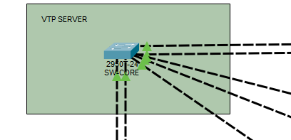 |
| Granja de Servidores |  |
| Centro de I+D |  |
| Edificio Corporativo | 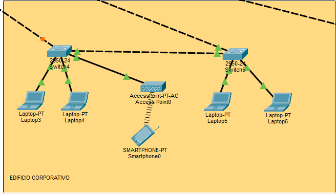 |
| Planta de Producción |  |

## 4. Inventario de switches y roles

| Hostname | Modelo | Rol VTP | Área |
|---|---|---|---|
| SW-CORE | 2950T-24 | Server | Core / Centro de Datos |
| SW-SERV | 2950-24 | Client | Granja de Servidores |
| SW-IyD1 | 2950-24 | Client | Centro de I+D |
| SW-IyD2 | 2950-24 | Client | Centro de I+D |
| SW-IyD3 | 2950-24 | Client | Centro de I+D |
| SW-IyD4 | 2950-24 | Client | Centro de I+D |
| SW-CorpA | 2950-24 | Client | Edificio Corporativo (Ala A) |
| SW-CorpB | 2950-24 | Client | Edificio Corporativo (Ala B) |
| SW-Prod | 2950-24 | Client | Planta de Producción |

## 5. Justificación de medios de transmisión

| Enlace | Medio | Justificación |
|---|---|---|
| Core ↔ Granja de Servidores | Cobre UTP x2, EtherChannel PAgP | Alto volumen de tráfico crítico hacia los servidores; no depende de una única conexión física. |
| Core ↔ Centro de I+D | Cobre UTP x2, EtherChannel PAgP | Requisito explícito de mayor ancho de banda que el resto de los trunks del campus; se logra por agregación de enlaces (200 Mbps agregados). |
| Core ↔ Ala A (Corporativo) | Cobre UTP x1 | Enlace troncal estándar del campus. |
| Core ↔ Ala B (Corporativo) | Cobre UTP x1 | Enlace troncal estándar; ruta independiente de Ala A para tolerancia a fallos. |
| Ala A ↔ Ala B | Cobre UTP x1 | Enlace de respaldo, activo solo si falla la ruta directa de cualquiera de las dos alas hacia el Core (gestionado por Rapid-PVST). |
| Core ↔ Planta de Producción | Cobre UTP x1 | Enlace troncal estándar del campus. |

## 6. EtherChannel — ubicación y evidencia

Se implementó agregación de enlaces (**PAgP**) en dos puntos de la red:

1. **Core ↔ Granja de Servidores** (Port-channel 1): interfaces Fa0/2 y Fa0/3 en SW-CORE, Fa0/5 y Fa0/6 en SW-SERV.
2. **Core ↔ Centro de I+D** (Port-channel 2): interfaces Fa0/1 y Fa0/7 en SW-CORE, Fa0/1 y Fa0/5 en SW-IyD1.

Ambos Port-channel muestran estado `(SU)` — Up, en uso — con las dos interfaces físicas de cada uno en estado `(P)` — bundled correctamente.

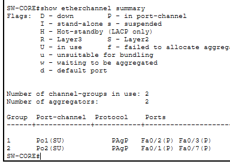
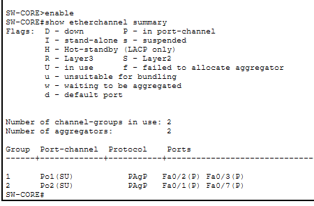
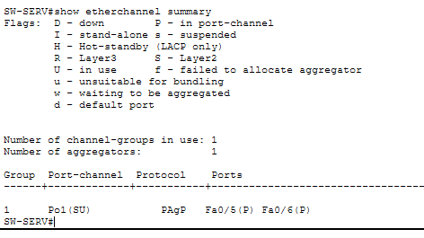
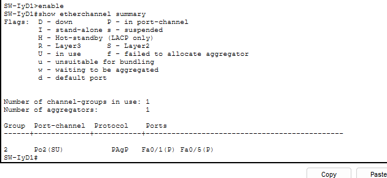

## 7. Spanning Tree — selección de Root Bridge

Protocolo utilizado: **Rapid-PVST** (carné impar).

| VLAN | Switch Root Bridge | Justificación |
|---|---|---|
| 1 (default) | Automático (sin configurar explícitamente) | VLAN de gestión, no crítica para el tráfico de negocio. |
| 19 (GERENCIA) | **SW-CORE** | Priority 24576; concentra el tráfico administrativo desde el núcleo de la red hacia ambas alas del Corporativo. |
| 29 (INVESTIGACION) | **SW-IyD1** | Switch de I+D con conexión directa (EtherChannel) hacia el Core; minimiza saltos para el tráfico de investigación. |
| 39 (PRODUCCION) | **SW-Prod** | Único switch de la Planta de Producción; concentra el tráfico del segmento Legacy antes de salir al campus. |
| 49 (SERVIDORES) | **SW-SERV** | Priority 24625; cercanía directa a los 4 servidores críticos, minimiza latencia hacia ellos. |
| 59 (VISITANTES) | **SW-CORE** | Priority 24576; centraliza el control del tráfico aislado de visitantes desde el núcleo. |

**Evidencia — antes y después de fijar el Root Bridge explícito:**

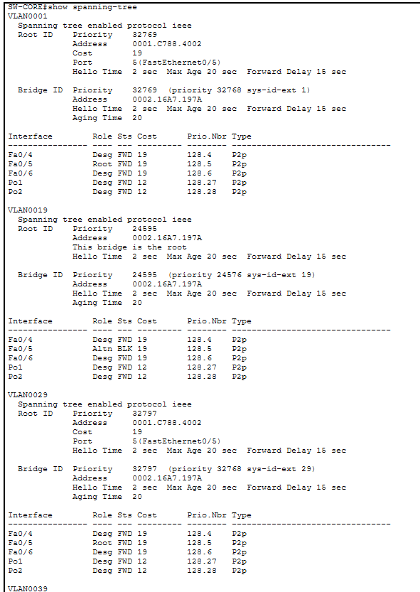
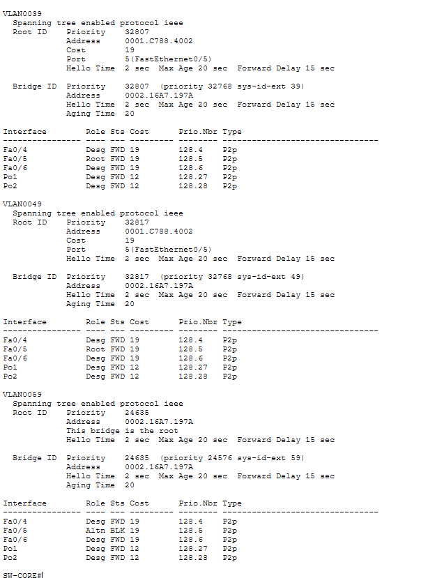
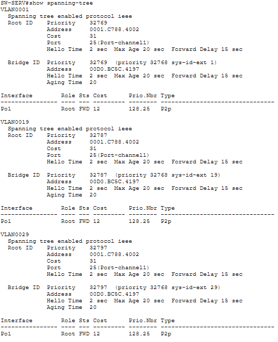
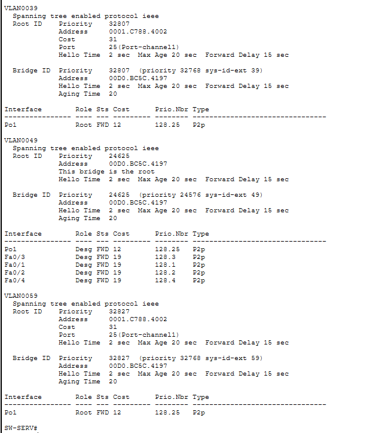
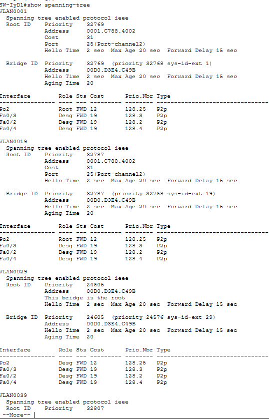

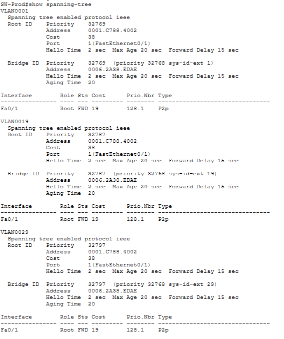

## 8. Segmento Legacy (Planta de Producción)

La Planta de Producción integra maquinaria industrial heredada (impresora, PC y laptop) conectada a través de un **Hub** hacia el switch de acceso SW-Prod (puerto Fa0/2, VLAN 39).

**Impacto del dominio de colisión compartido:**
Todos los dispositivos conectados al Hub comparten el mismo medio físico y el mismo dominio de colisión: solo un dispositivo puede transmitir a la vez sin generar una colisión, a diferencia de los puertos de un switch, donde cada uno constituye su propio dominio de colisión en full-duplex. Esto reduce el ancho de banda efectivo disponible por dispositivo a medida que aumenta el número de equipos conectados al Hub, y genera retransmisiones (backoff) cuando ocurre una colisión.

**Evidencia — todas las MAC del segmento Legacy se ven a través de un único puerto físico (Fa0/1) del Hub hacia SW-Prod:**

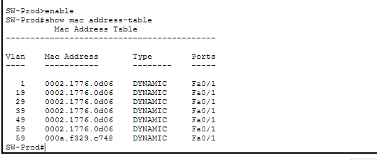

**Medidas de contención aplicadas (a nivel del switch de acceso):**
- El puerto Fa0/2 de SW-Prod (hacia el Hub) está configurado en modo access, VLAN 39, aislando el tráfico de colisión de ese segmento del resto del dominio de broadcast del campus.
- El resto de la red (switches en el Core, I+D y Corporativo) no se ve afectada por las colisiones internas del segmento Legacy, ya que estas quedan contenidas dentro del propio Hub y no se propagan más allá del puerto de acceso Fa0/2.

## 9. Dominios de colisión

En una red conmutada, **cada puerto activo de un switch en modo access o trunk full-duplex constituye su propio dominio de colisión**. El único dominio de colisión *compartido* de todo el proyecto es el del segmento Legacy conectado al Hub.

| Switch | Puertos activos (up) | Dominios de colisión generados |
|---|---|---|
| SW-CORE | 7 (Fa0/1-7; Po1 y Po2 son lógicos, no cuentan aparte) | 7 |
| SW-SERV | 6 (Fa0/1-6) | 6 |
| SW-IyD1 | 5 (Fa0/1-5) | 5 |
| SW-IyD2 | 5 (Fa0/1-5) | 5 |
| SW-IyD3 | 5 (Fa0/1-5) | 5 |
| SW-IyD4 | 5 (Fa0/1-5) | 5 |
| SW-CorpA | 5 (Fa0/1-5) | 5 |
| SW-CorpB | 4 (Fa0/1-4) | 4 |
| SW-Prod (solo el puerto Fa0/1, trunk hacia el Core) | 1 | 1 |
| **Hub Único (Planta de Producción)** | Fa0/2 de SW-Prod + Printer0 + PC6 + Laptop2 | **1 dominio de colisión compartido** |
| **TOTAL** | | **44 dominios de colisión** |

## 10. Dominios de broadcast

Cada VLAN activa constituye un dominio de broadcast independiente, delimitado por los switches y propagado únicamente donde esa VLAN está permitida en los enlaces troncales.

| VLAN ID | Nombre | Dominios de broadcast | Switches / segmentos donde existe |
|---|---|---|---|
| 19 | GERENCIA | 1 | SW-CorpA, SW-CorpB |
| 29 | INVESTIGACION | 1 | SW-IyD1, SW-IyD2, SW-IyD3, SW-IyD4 |
| 39 | PRODUCCION | 1 | SW-Prod + Hub Único |
| 49 | SERVIDORES | 1 | SW-SERV |
| 59 | VISITANTES | 1 | SW-CorpA (puerto del Access Point) |

## 11. Evidencia de pruebas

### 11.1 `show spanning-tree`
Ver sección 7.

### 11.2 `show etherchannel summary`
Ver sección 6.

### 11.3 `show interfaces trunk`

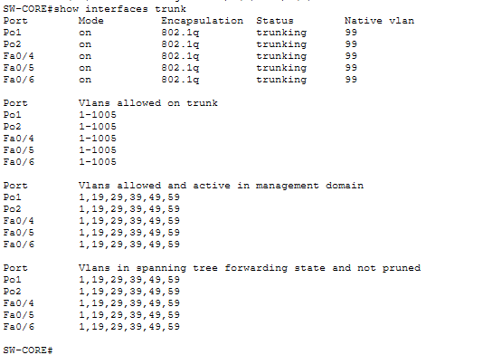
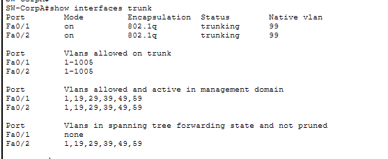

### 11.4 `show vlan brief` por switch

| Switch | Imagen |
|---|---|
| SW-CorpA |  |
| SW-CorpB | 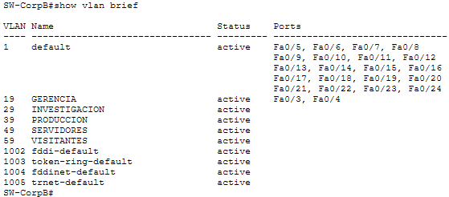 |
| SW-IyD1 | 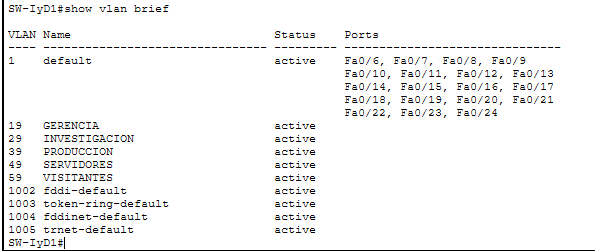 |
| SW-IyD2 | 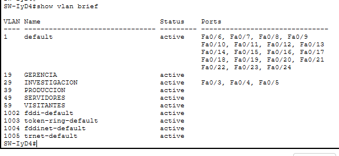 |
| SW-IyD3 |  |
| SW-IyD4 |  |
| SW-Prod | 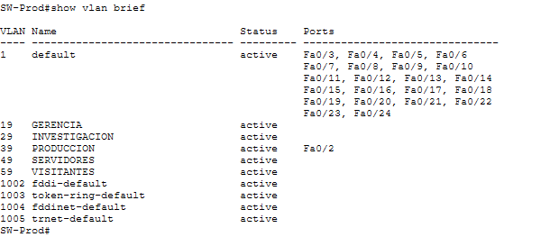 |
| SW-SERV | 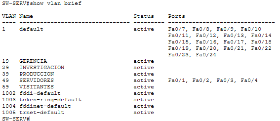 |

### 11.5 Pruebas de ping

| Origen | Destino | Resultado esperado | Resultado obtenido |
|---|---|---|---|
| PC0 (VLAN 29) | PC2 (VLAN 29) | Exitoso (misma VLAN) | _completa_ |
| PC0 (VLAN 29) | Server0 (VLAN 49) | Fallido (VLANs distintas, sin enrutamiento) | _completa_ |
| Laptop3 (VLAN 19) | Laptop5 (VLAN 19) | Exitoso (misma VLAN) | _completa_ |
| Smartphone0 (VLAN 59) | Laptop3 (VLAN 19) | Fallido (aislamiento de visitantes) | _completa_ |
| PC6 (Hub, VLAN 39) | Server0 (VLAN 49) | Fallido (VLANs distintas) | _completa_ |

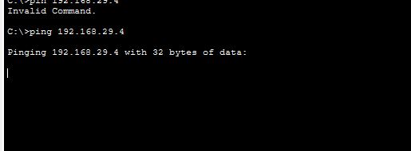
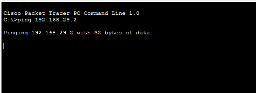

> **Nota técnica:** el ping entre VLANs distintas debe fallar siempre en este proyecto, ya que no existe enrutamiento inter-VLAN (Capa 3) — el alcance del proyecto es únicamente Capa 1 y 2. Ese fallo es la prueba misma del aislamiento que pide el enunciado, no un error.

## 12. Presupuesto estimado de equipos

| Equipo | Cantidad | Costo unitario estimado (Q) | Subtotal |
|---|---|---|---|
| Switch Cisco Catalyst 2950-24 | 9 | _completa_ | _completa_ |
| Cable UTP Cat6 (tramo) | _completa_ | _completa_ | _completa_ |
| Hub 4-8 puertos (segmento Legacy) | 1 | _completa_ | _completa_ |
| Access Point | 1 | _completa_ | _completa_ |
| **Total** | | | **_completa_** |

---

## 13. Conclusiones

Se logra entender la complejidad que lleva una red en una empresa y como configurar paso a paso algo para que todo funcione en sincronia, en lo personal es la primera vez
que armo una red de esta magnitud, lo cual me gusto mucho y me sirvio de mucho conocimiento nuevo.